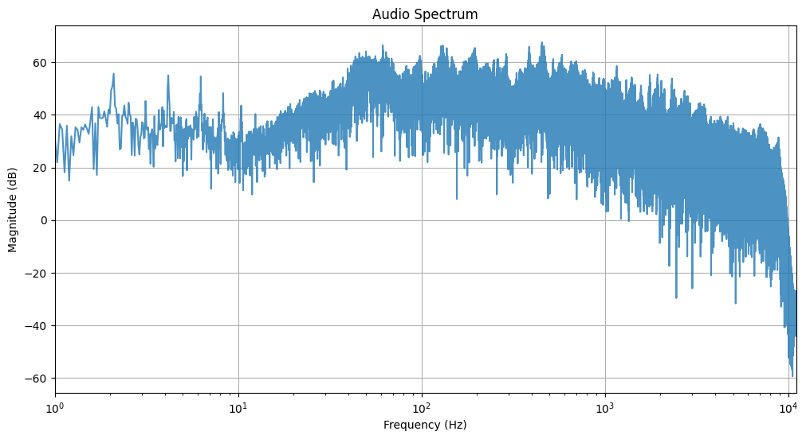
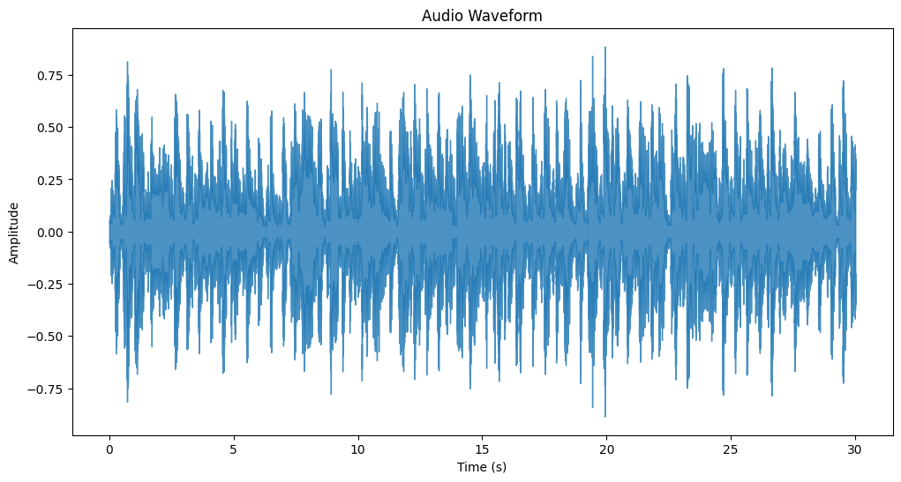
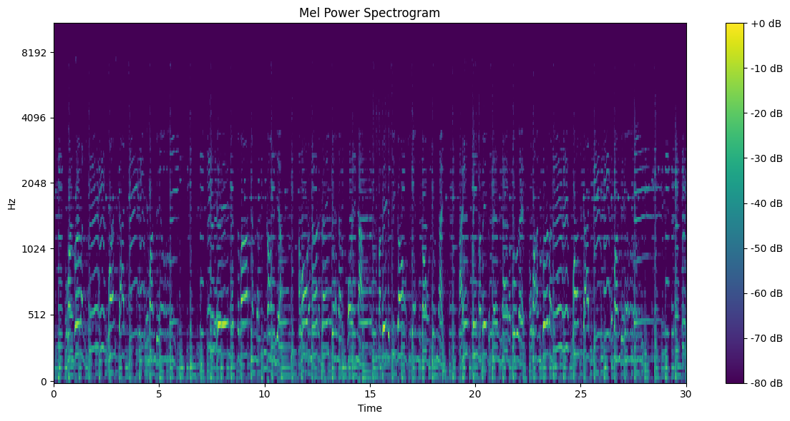
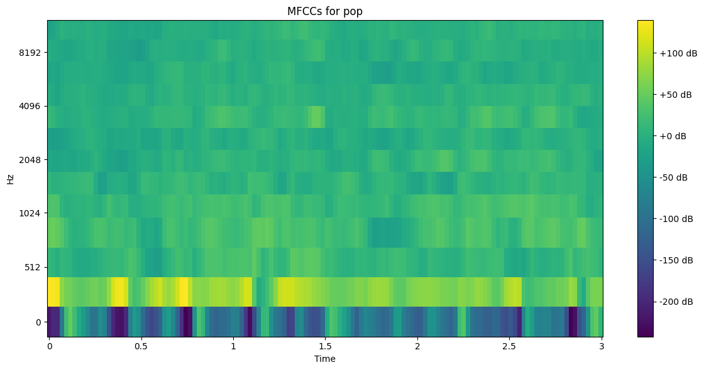

# Musicly AI 🎵

Musicly AI is an intelligent music system designed to classify songs into genres, extract lyrics using Automatic Speech Recognition (ASR), and generate genre-specific lyrics. Additionally, the system can extend songs with instrumental enhancements, creating a seamless listening experience. This project leverages machine learning, deep learning, and natural language processing (NLP) techniques, integrated with a Flask web application for a user-friendly interface.

## Features ✨
- **Song Genre Classification**: Identifies the genre of a song using Convolutional Neural Networks (CNNs).
- **Lyric Extraction**: Automatically extracts lyrics from songs using ASR techniques.
- **Lyric Generation**: Generates genre-specific lyrics based on the song's lyrical and contextual patterns.
- **Song Extension**: Adds instrumental enhancements to extend the song duration.
- **Web Interface**: Simple and interactive Flask web app for song uploads and outputs.

---

## Tech Stack 🛠️
- **Programming Language**: Python 3
- **Frameworks**:
  - Flask (Web Development)
  - TensorFlow/Keras (Deep Learning)
- **Libraries**:
  - Librosa (Audio Feature Extraction)
  - OpenAI API (Lyric Generation)
  - Whisper (Automatic Speech Recognition)
- **Tools**:
  - Pretrained ASR models
  - GTZAN and FMA datasets (for training and testing)

___

## Data

Data can be retrieved from the [GTZAN Genre Dataset](https://www.kaggle.com/datasets/andradaolteanu/gtzan-dataset-music-genre-classification), which provides audio files categorized into 10 genres:

- **Genres**: Blues, Classical, Country, Disco, Hip Hop, Jazz, Metal, Pop, Reggae, Rock
- **Files per Genre**: 100 audio files
- **Duration**: Each file is 30 seconds long
- **Sampling Rate**: 22050 Hz

### Preprocessing
The dataset is processed by:
- Splitting audio files into smaller segments for training (3-second clips).
- Creating Audio Waveform, Spectogram, and Mel-Spectogram visualizations.
- Extracting MFCC (Mel Frequency Cepstral Coefficients) features for each segment as input for the model.

Visualizations:
| Audio Spectrum | Audio Waveform |
|---------------|----------------|
|  |  |

| Mel Spectrogram | MFCC |
|-----------------|------|
|  |  |
